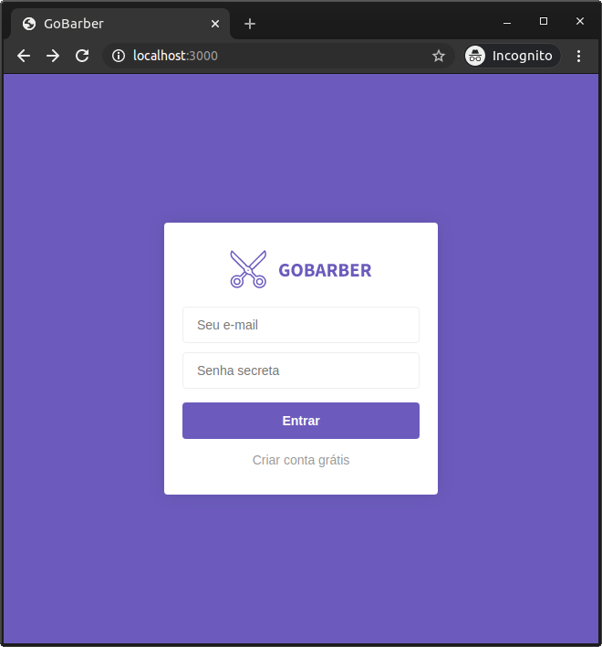
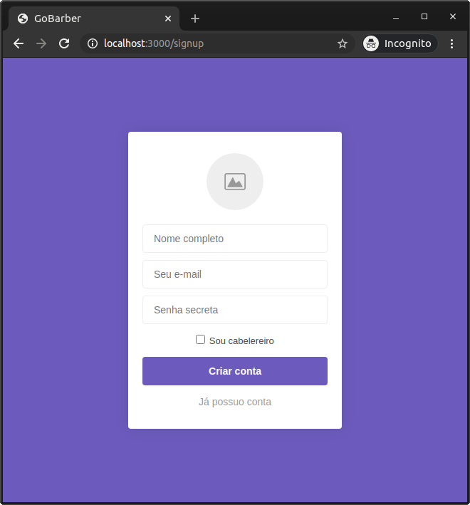
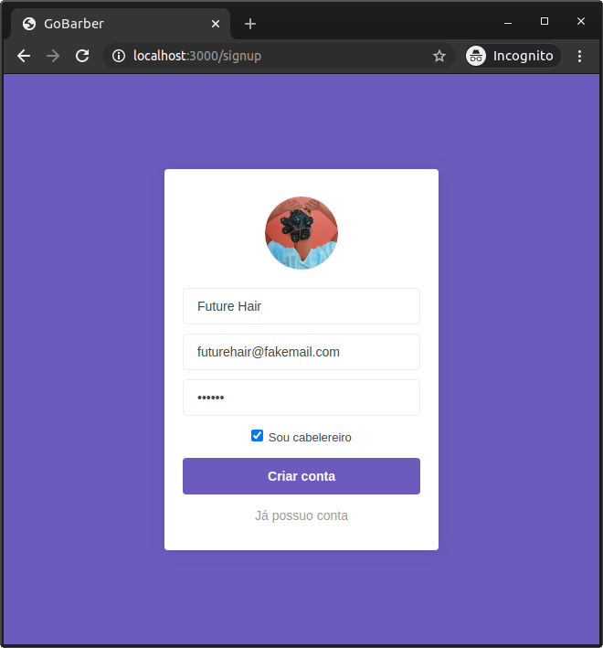
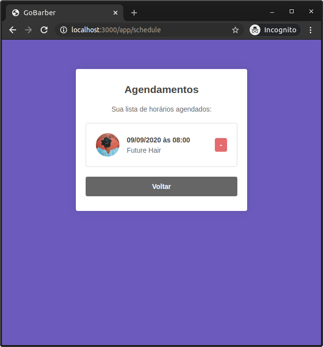
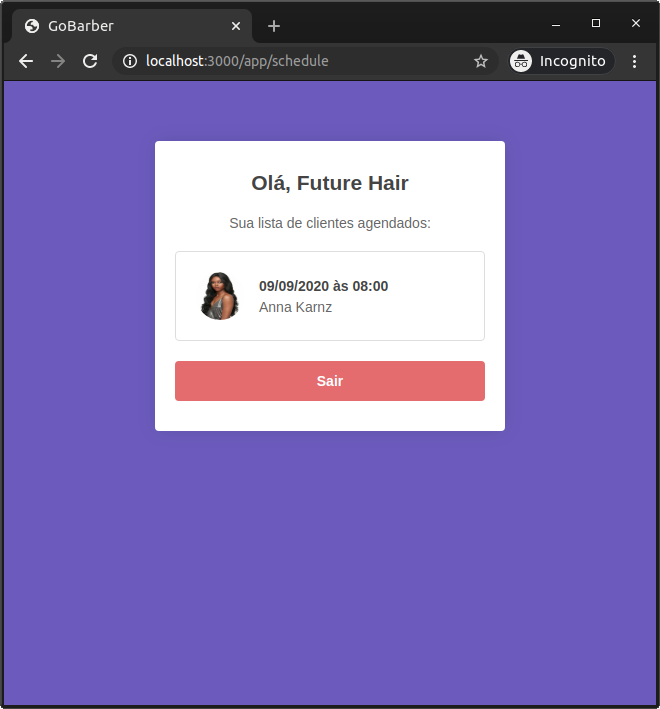

### GoBarber

Aplicação para agendamentos de barbearia/cabeleireiro criado no Bootcamp da [Rocketseat](https://rocketseat.com.br) em 2019.

## Instalação (development)

1. Faça um clone do projeto em sua máquina e acesse a raiz do projeto. Lembrando que é necessário ter o [Node.js](https://nodejs.org) e [Docker](https://www.docker.com) instalado.

2. Instale as dependências com `npm install`.

3. Instale o banco de dados `Postegres` via `Docker`, execute `docker-compose up -d`. O usuário/senha estão no arquivo `.env`.

4. Verifique se o diretório `tmp/sessions` e `tmp/uploads` está com permissão de escrita, caso contrário execute `chmod 777 -Rf tmp`.

5. Rode as migrations para criar as tabelas no banco de dados, execute `npx sequelize-cli db:migrate`.

6. Para iniciar a aplicação execute `npm run dev`.

7. Acesse o endereço http://localhost:3000 no seu navegador.

8. Pronto, agora simule um cadastro de calebeleiro para ver seus agendamentos e outro como cliente para fazer um agendamento. Ambos os cadastros precisam escolher a foto do avatar ;)

## Tecnologias

- [Node.js](https://nodejs.org)
- [Express](https://expressjs.com)
- [Postgres](https://hub.docker.com/_/postgres)
- [Docker](https://www.docker.com)
- [Sequelize](https://sequelize.org/v5/)
- [Nunjucks](https://mozilla.github.io/nunjucks)
- [Multer](https://github.com/expressjs/multer)

## Autor

- [@giovanigenerali](https://github.com/giovanigenerali)
